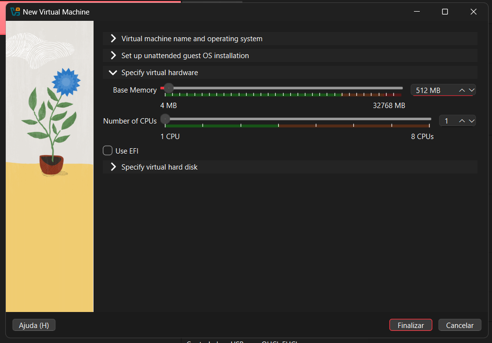
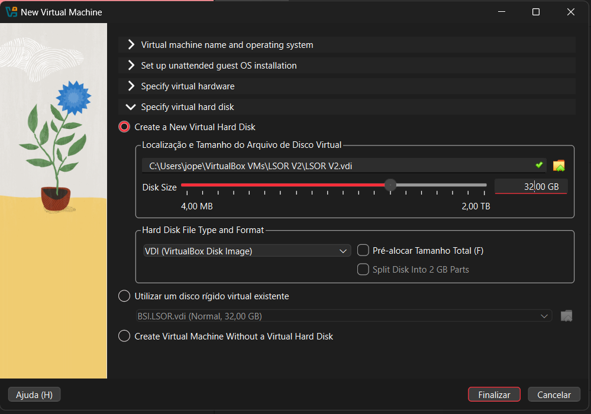
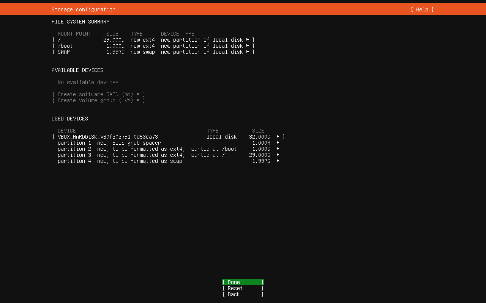
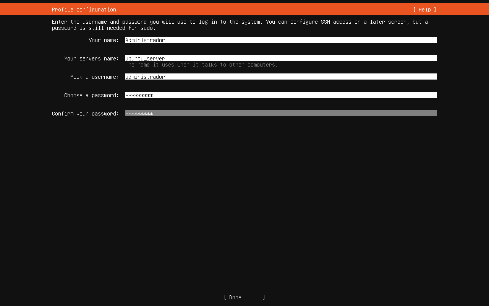
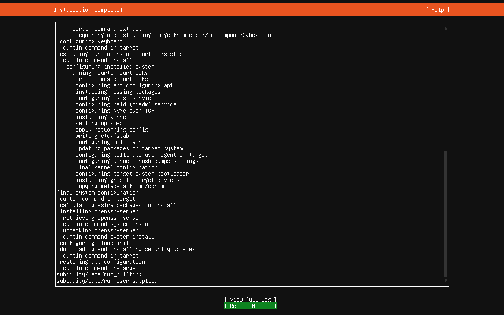
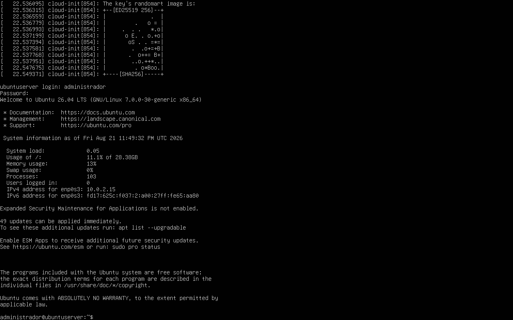

# Relatório Técnico - Aula Prática 01

## 1. Identificação
- Título da prática: Introdução à Virtualização e Instalação do Ubuntu Server 26.04
- Aluno: João Pedro de Castro Laranjeira Rocha
- Matrícula: 2023007098
- Turma: LSOR - BSI
- Data da prática: 21/08/2026

## 2. Objetivo
Instalar uma máquina virtual Linux no Oracle VM VirtualBox, configurar o Ubuntu Server 26.04 LTS com conta administrativa local e validar o primeiro boot do sistema para uso nas próximas aulas de laboratório.

## 3. Ambiente
- Sistema hospedeiro: Windows
- Hipervisor: Oracle VM VirtualBox
- Sistema convidado: Ubuntu Server 26.04 LTS
- Recursos da VM: 2048 MB de RAM, 1 CPU e disco virtual VDI de 32 GB
- Interface de rede observada após a instalação: `enp0s3`
- Endereço IPv4 obtido no primeiro login: `10.0.2.15`
- Usuário administrativo criado: `administrador`

## 4. Procedimento
1. Foi criada uma nova máquina virtual no VirtualBox com `2048 MB` de memória RAM e `1 CPU`.
2. Foi configurado um disco virtual do tipo `VDI` com capacidade de `32 GB`.
3. A instalação do Ubuntu Server foi iniciada a partir da imagem ISO do sistema.
4. O particionamento foi realizado manualmente com a seguinte estrutura registrada no instalador:

| Ponto de montagem | Tamanho | Tipo |
| --- | --- | --- |
| `/boot` | `1.000G` | `ext4` |
| `/` | `29.000G` | `ext4` |
| `swap` | `1.997G` | `swap` |

5. Foi configurado o perfil administrativo com nome `Administrador` e usuário `administrador`.
6. Na fase final da instalação, o log exibiu a instalação do pacote `openssh-server`, seguida da opção de reinicialização do sistema.
7. Após o reboot, o sistema apresentou a tela de login, permitindo acesso com o usuário criado e exibindo as informações gerais do servidor.

## 5. Testes e Evidências

**Print 1 - Configuração do hardware da VM**

**Print 2 - Criação do disco virtual VDI com 32,00 GB**

**Print 3 - Resumo do particionamento realizado no instalador**

**Print 4 - Configuração do perfil com nome Administrador e usuário administrador**

**Print 5 - Conclusão da instalação com instalação do openssh-server e opção Reboot Now**

**Print 6 - Primeiro login no Ubuntu Server 26.04 LTS com exibição do IP 10.0.2.15**

A VM foi criada corretamente, o sistema operacional foi instalado com sucesso e o primeiro acesso ao servidor foi concluído sem erro de inicialização.

## 6. Problemas e Soluções
- O roteiro menciona particionamento com LVM, mas não consegui configurar o grupo da LVM, entao segui com partições diretas em `ext4` e `swap`, sem grupo de volumes LVM visível.

## 7. Conclusão
A prática permitiu montar o ambiente base de laboratório para as próximas aulas, passando pela criação da máquina virtual, definição de recursos, instalação do Ubuntu Server e validação do primeiro acesso ao sistema. Os prints confirmam que o servidor ficou operacional, com rede ativa e usuário administrativo funcional, formando a base para os exercícios de usuários, grupos, permissões e estrutura de diretórios desenvolvidos nas aulas seguintes.
