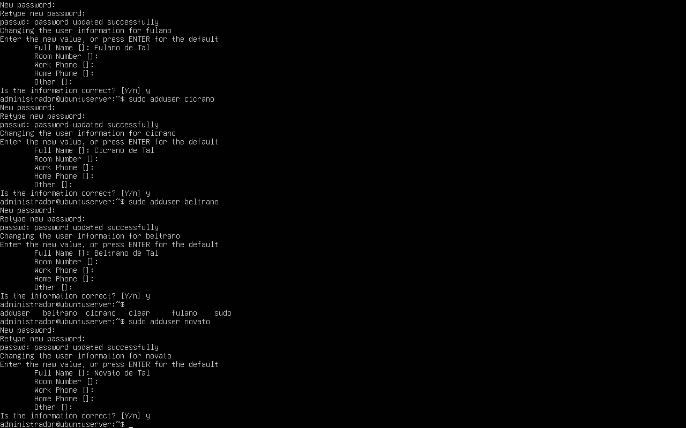
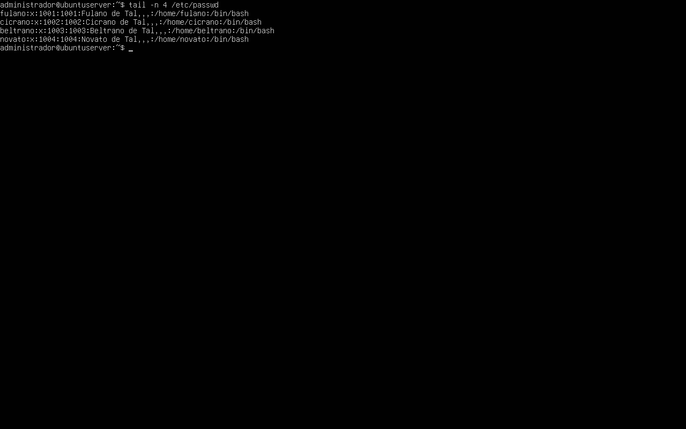
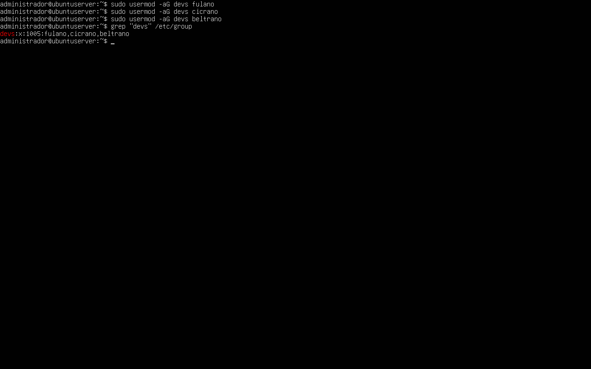
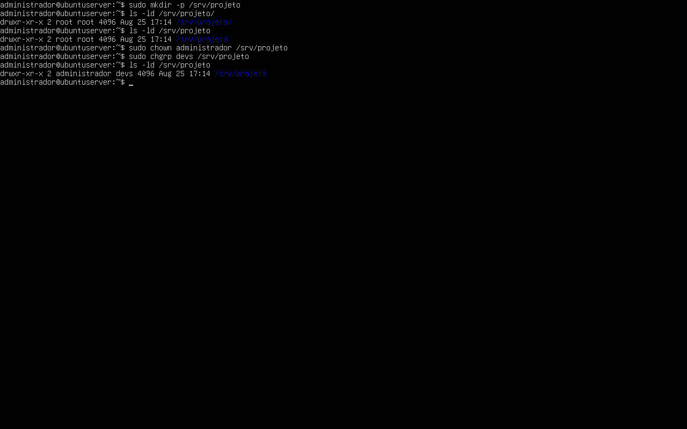
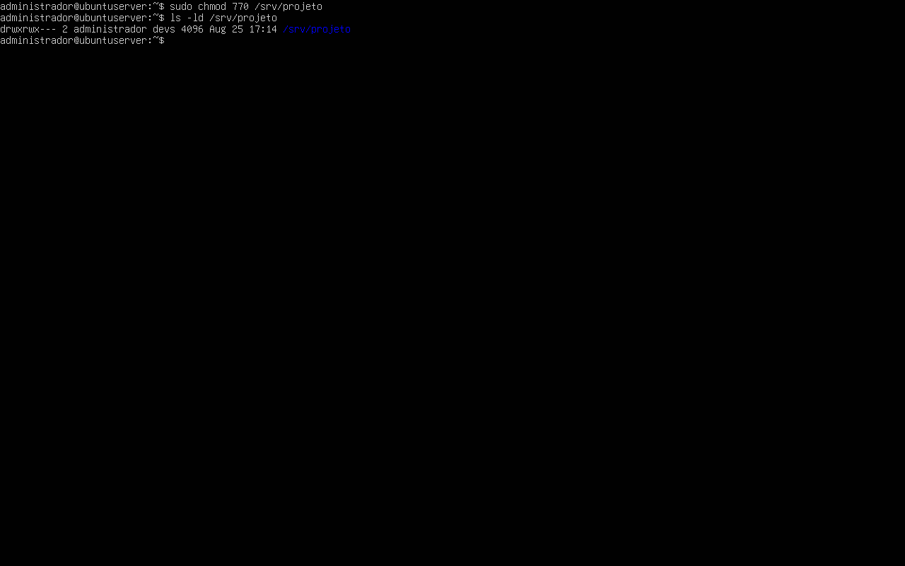
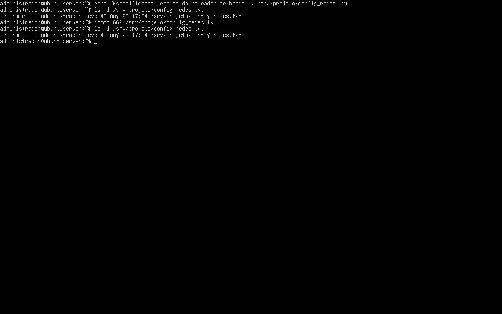
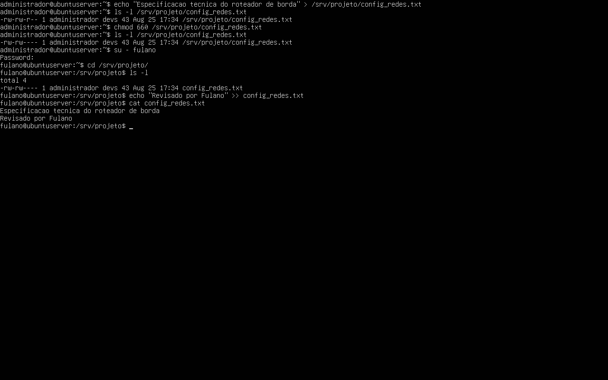
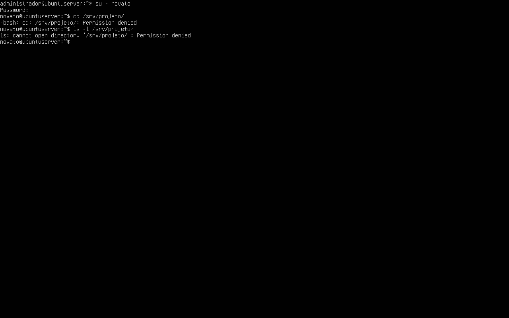
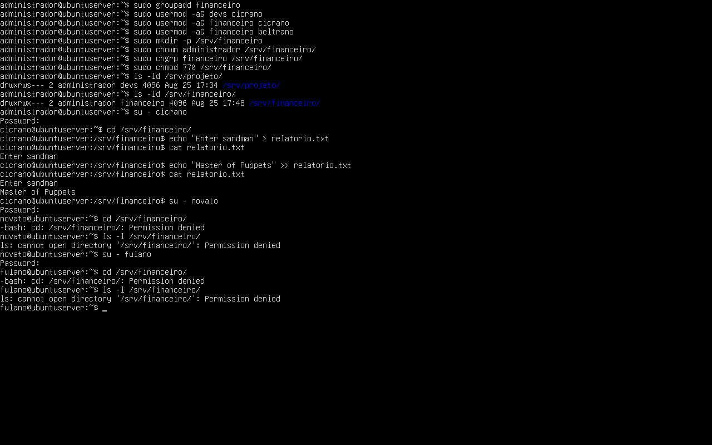

# Relatório Técnico - Aula Prática 02

## 1. Identificação
- Título da prática: Administração de Usuários, Grupos e Permissões no Linux
- Aluno: João Pedro de Castro Laranjeira Rocha
- Matrícula: 2023007098
- Turma: LSOR - BSI
- Data da prática: 25/08/2026

## 2. Objetivo
Executar a administração básica de usuários e grupos no Ubuntu Server, aplicar permissões de acesso em diretórios e arquivos e validar, na prática, o isolamento entre usuários autorizados e não autorizados.

## 3. Ambiente
- Sistema operacional: Ubuntu Server 26.04 LTS
- Ambiente de execução: máquina virtual criada na Aula 1
- Usuário administrativo utilizado: `administrador`
- Diretórios de trabalho criados na prática: `/srv/projeto` e `/srv/financeiro`
- Grupos utilizados: `devs` e `financeiro`
- Usuários de teste: `fulano`, `cicrano`, `beltrano` e `novato`

## 4. Procedimento
1. Foram criados os usuários `fulano`, `cicrano`, `beltrano` e `novato` com o comando `adduser`, incluindo a criação automática dos diretórios pessoais em `/home`.
2. A criação das contas foi validada pela consulta às quatro últimas linhas do arquivo `/etc/passwd`.
3. Foi criado o grupo `devs`, e os usuários `fulano`, `cicrano` e `beltrano` foram adicionados a esse grupo com `usermod -aG`.
4. Foi criado o diretório compartilhado `/srv/projeto`.
5. O diretório `/srv/projeto` teve sua posse alterada para usuário `administrador` e grupo `devs` com os comandos `chown` e `chgrp`.
6. Em seguida, foi aplicada a permissão `770` ao diretório para permitir acesso total apenas ao dono e ao grupo associado.
7. Dentro da pasta `/srv/projeto`, foi criado o arquivo `config_redes.txt` com conteúdo inicial de documentação técnica.
8. O arquivo foi ajustado de sua permissão padrão inicial para `660`, garantindo leitura e escrita apenas para dono e grupo.
9. Nos testes de validação, o usuário `fulano` acessou a pasta, listou o conteúdo e acrescentou a linha `Revisado por Fulano` ao arquivo.
10. O usuário `novato`, que não pertence ao grupo `devs`, teve acesso negado tanto ao tentar entrar no diretório quanto ao listar seu conteúdo.
11. No exercício de fixação, foi criado o grupo `financeiro`, os usuários `cicrano` e `beltrano` foram associados a ele, e foi criada a pasta `/srv/financeiro` com permissão `770`.
12. O usuário `cicrano` conseguiu criar e editar o arquivo `relatorio.txt` em `/srv/financeiro`, enquanto `novato` e `fulano` receberam `Permission denied`.

## 5. Testes e Evidências

**Print 1 - Criação dos usuários fulano, cicrano, beltrano e novato**

**Print 2 - Validação das contas pelo arquivo /etc/passwd**

**Print 3 - Associação dos usuários ao grupo devs**

**Print 4 - Criação de /srv/projeto e alteração de dono e grupo**

**Print 5 - Aplicação da permissão 770 em /srv/projeto**

**Print 6 - Criação do arquivo config_redes.txt e observação da permissão inicial**

**Print 7 - Acesso autorizado de fulano com leitura e escrita no arquivo compartilhado**

**Print 8 - Bloqueio total do usuário novato no diretório /srv/projeto**

**Print 9 - Exercício prático com /srv/financeiro, incluindo sucesso de cicrano e bloqueio de novato e fulano**

Os testes confirmam que a política aplicada em `/srv/projeto` e `/srv/financeiro` funcionou conforme esperado: membros do grupo autorizado puderam acessar e modificar os arquivos, enquanto usuários externos foram impedidos de navegar e listar o conteúdo.

## 6. Problemas e Soluções
- Após a criação de `config_redes.txt`, o arquivo apareceu inicialmente com permissão mais aberta para terceiros, registrada no print como `-rw-rw-r--`. Em seguida, a situação foi corrigida manualmente com `chmod 660`, restringindo o acesso apenas ao dono e ao grupo. Isso evidencia a importância de validar a permissão real após a criação do arquivo.
- O uso de `su -` nos testes foi importante para reproduzir o contexto real de login dos usuários, evitando resultados incorretos por herança da sessão administrativa.

## 7. Conclusão
A aula demonstrou de forma prática como o Linux controla acesso com base em usuários, grupos, posse e permissões. Os resultados mostraram que o modelo de segurança funcionou corretamente tanto no diretório de projeto quanto no exercício do setor financeiro, reforçando a importância de configurar `chown`, `chgrp` e `chmod` de forma consistente em ambientes de servidor.
