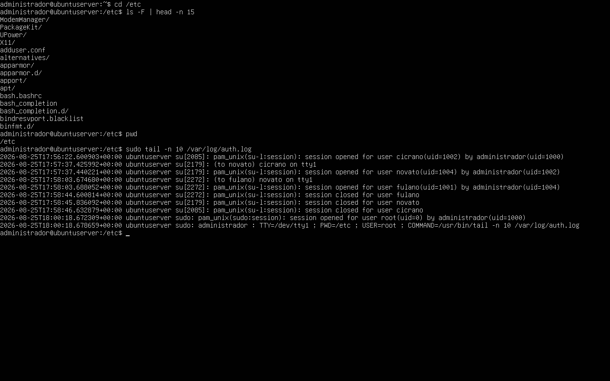
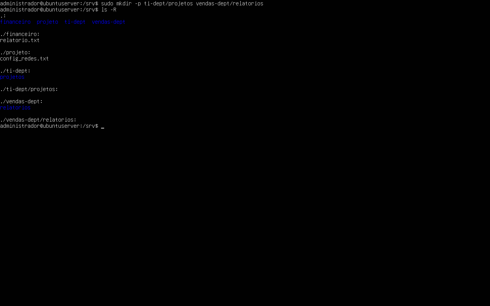
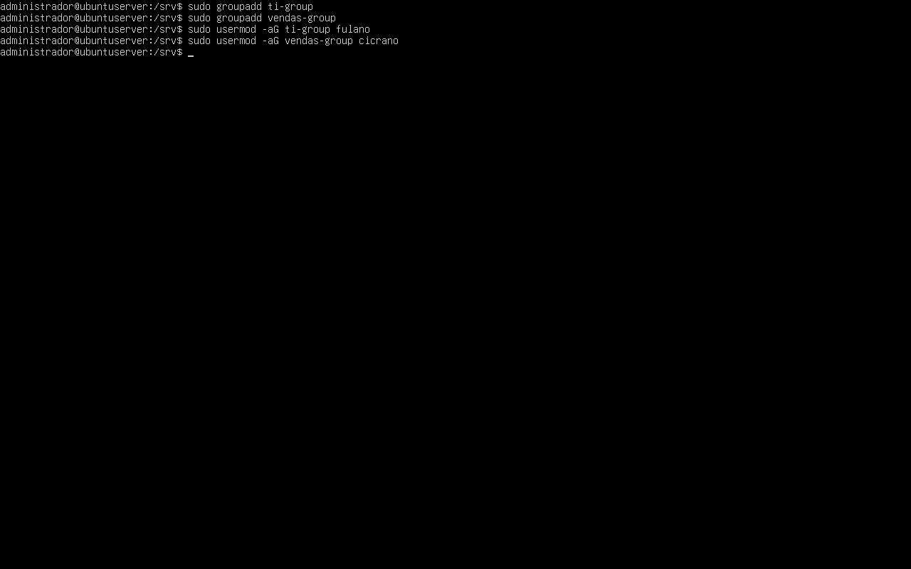
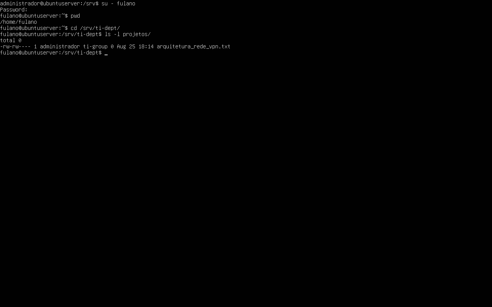
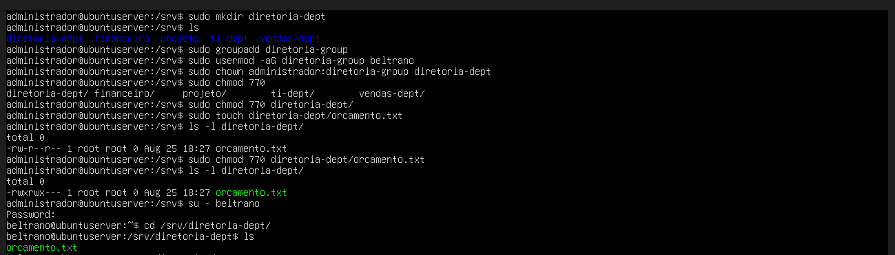
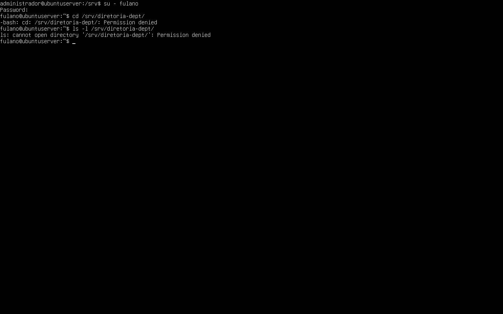

# Relatório Técnico - Aula Prática 03

## 1. Identificação
- Título da prática: Estrutura de Diretórios, FHS e Permissões Avançadas no Linux Server
- Aluno: João Pedro de Castro Laranjeira Rocha
- Matrícula: 2023007098
- Turma: LSOR - BSI
- Data da prática: 25/08/2026

## 2. Objetivo
Explorar diretórios fundamentais do sistema Linux segundo o padrão FHS, criar estruturas departamentais sob `/srv`, associar grupos a essas estruturas e validar o isolamento de acesso entre usuários de diferentes setores.

## 3. Ambiente
- Sistema operacional: Ubuntu Server 26.04 LTS
- Ambiente de execução: máquina virtual criada na Aula 1
- Usuário administrativo utilizado: `administrador`
- Diretórios criados na prática: `/srv/ti-dept`, `/srv/ti-dept/projetos`, `/srv/vendas-dept`, `/srv/vendas-dept/relatorios` e `/srv/diretoria-dept`
- Grupos utilizados: `ti-group`, `vendas-group` e `diretoria-group`
- Usuários envolvidos nos testes: `fulano`, `cicrano` e `beltrano`

## 4. Procedimento
1. Foi feita a navegação até `/etc`, seguida de listagem parcial do conteúdo e verificação do diretório atual com `pwd`.
2. Foi consultado o arquivo de log `/var/log/auth.log` para visualizar eventos recentes de autenticação e uso de `sudo`.
3. No diretório `/srv`, foram criadas de forma recursiva as estruturas `ti-dept/projetos` e `vendas-dept/relatorios` com `mkdir -p`.
4. Foram criados os grupos `ti-group` e `vendas-group`.
5. O usuário `fulano` foi adicionado ao grupo `ti-group`, e o usuário `cicrano` foi adicionado ao grupo `vendas-group`.
6. As pastas departamentais inicialmente pertencentes a `root:root` tiveram sua posse alterada para `administrador:ti-group` e `administrador:vendas-group`.
7. Foram aplicadas permissões `770` nas duas pastas principais, garantindo acesso apenas ao administrador e ao grupo correspondente.
8. A posse das estruturas internas também foi ajustada de forma recursiva.
9. Foi criado o arquivo `arquitetura_rede_vpn.txt` em `/srv/ti-dept/projetos`, com posse `administrador:ti-group` e permissão `660`.
10. No teste de validação, `fulano` conseguiu acessar `/srv/ti-dept` e listar o arquivo do seu departamento.
11. Em contrapartida, `cicrano` recebeu `Permission denied` ao tentar acessar a pasta de Tecnologia.
12. No desafio adicional, foi criada a pasta `/srv/diretoria-dept`, o grupo `diretoria-group`, e o usuário `beltrano` foi associado a esse grupo.
13. A pasta da diretoria recebeu dono `administrador`, grupo `diretoria-group` e permissão `770`.
14. Foi criado o arquivo `orcamento.txt` dentro da pasta da diretoria e realizado um teste de acesso com `beltrano` e `fulano`.

## 5. Testes e Evidências

**Print 1 - Inspeção de /etc, confirmação do pwd e leitura de /var/log/auth.log**

**Print 2 - Criação recursiva das estruturas ti-dept/projetos e vendas-dept/relatorios**

**Print 3 - Criação dos grupos ti-group e vendas-group e associação de usuários**

**Print 4 e 5 - Ajuste de posse, permissões 770 e criação do arquivo arquitetura_rede_vpn.txt**

**Print 6 - Acesso autorizado de fulano ao diretório /srv/ti-dept**

**Print 7 - Bloqueio de cicrano ao tentar acessar o diretório de TI**

**Print 8 - Execução do desafio com criação de /srv/diretoria-dept, associação de beltrano e acesso listado pelo usuário autorizado**

**Print 9 - Bloqueio de fulano ao tentar acessar o diretório da diretoria**

As evidências demonstram que o isolamento entre departamentos funcionou corretamente no cenário principal da aula, especialmente entre os grupos `ti-group` e `vendas-group`. Também ficou comprovado o bloqueio de acesso a usuários sem vínculo com o grupo proprietário do diretório.

## 6. Problemas e Soluções
- Sem problemas para essa etapa

## 7. Conclusão
A prática consolidou o entendimento do padrão FHS e mostrou como a estrutura de diretórios em `/srv` pode ser usada para representar setores de uma organização. Os testes com `fulano` e `cicrano` comprovaram o isolamento entre departamentos, e o desafio da diretoria reforçou a necessidade de validar não apenas o diretório principal, mas também a posse e a permissão dos arquivos internos criados com privilégios administrativos.
