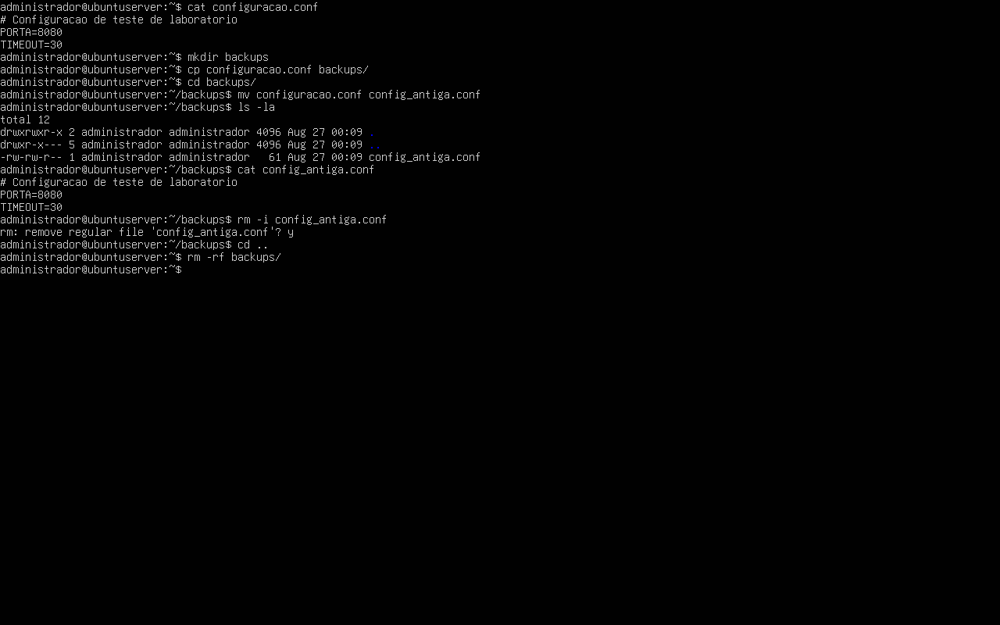
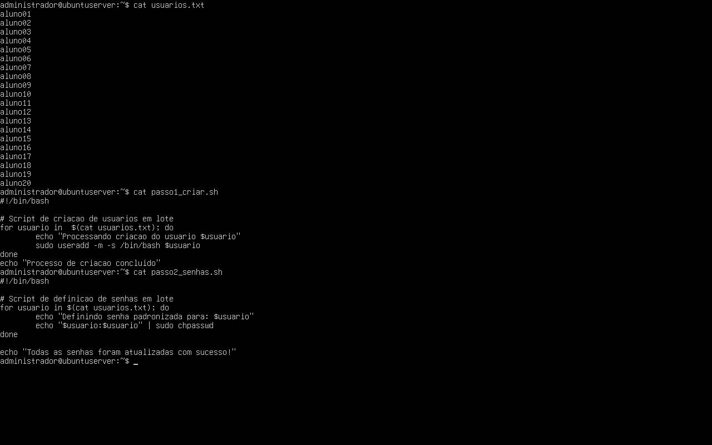

# Relatório Técnico - Aula Prática 04

## 1. Identificação
- Título da prática: Manipulação, Edição, Permissões e Automação de Arquivos no Linux
- Aluno: João Pedro de Castro Laranjeira Rocha
- Matrícula: 2023007098
- Turma: LSOR - BSI
- Data da prática: 26/08/2026

## 2. Objetivo
Manipular, visualizar e editar arquivos diretamente pelo terminal do Ubuntu Server, aplicando os editores de texto Nano e as ferramentas de leitura, e dar os primeiros passos em automação de tarefas administrativas criando scripts em Shell para criação e gerenciamento de contas de usuários em lote.

## 3. Ambiente
- Sistema operacional: Ubuntu Server 26.04 LTS
- Ambiente de execução: máquina virtual criada na Aula 1
- Usuário administrativo utilizado: `administrador`
- Arquivos criados na prática: `configuracao.conf`, `config_antiga.conf`, `usuarios.txt`, `passo1_criar.sh`, `passo2_senhas.sh` e a pasta `backups`
- Editores utilizados: `nano` e (conceitualmente) `vim`
- Contas criadas em lote: `aluno01` a `aluno20`

## 4. Procedimento
1. Foi criado o arquivo de texto vazio `configuracao.conf` com o comando `touch` no diretório home.
2. O arquivo foi aberto com o editor `nano`, onde foram inseridas as linhas de configuração de teste (`# Configuração de Teste do Laboratório`, `PORTA=8080` e `TIMEOUT=30`), salvas com `Ctrl + O` e saída com `Ctrl + X`.
3. Foi criada a pasta `backups` com `mkdir`.
4. O arquivo `configuracao.conf` foi copiado para dentro de `backups` com `cp`.
5. O arquivo original foi movido (renomeado) para `config_antiga.conf` com `mv`.
6. Foi exercitada a remoção segura com `rm -i`, que solicita confirmação antes de apagar o arquivo `config_antiga.conf`.
7. Em seguida, foi exercitada a remoção forçada e recursiva com `rm -rf backups`.
8. Foi criado o arquivo `usuarios.txt` com `nano`, contendo a lista de 20 nomes (`aluno01` a `aluno20`), um por linha.
9. Foi criado o script `passo1_criar.sh`, que utiliza um laço `for` para ler cada nome de `usuarios.txt` com `cat` e executar `sudo useradd -m -s /bin/bash` para criar cada conta com seu diretório home e shell padrão.
10. Foi criado o script `passo2_senhas.sh`, também com um laço `for`, que define a senha de cada usuário (igual ao próprio nome) utilizando o utilitário `chpasswd` no formato `usuario:senha`.
11. Aos dois scripts foi concedida permissão de execução com `chmod +x`, já que novos arquivos não possuem essa permissão por padrão.
12. Foram executados, em sequência, `./passo1_criar.sh` e `./passo2_senhas.sh`.
13. Para validar a criação, foram executados `getent passwd | tail -n 20` e `getent group | tail -n 20`, exibindo os últimos 20 registros de usuários e grupos inseridos.
14. Foi realizado um teste de login com um dos novos usuários utilizando `su - aluno01` para validar o carregamento do shell correto.

### Comandos principais utilizados
*   **`getent`:** consulta as bases de dados do sistema (`/etc/passwd` e `/etc/group`) de forma estruturada.
*   **`cat`:** lê o conteúdo de um arquivo; no script, é usado para ler a lista de `usuarios.txt`.
*   **`useradd`:** cria contas de usuários; as flags `-m` e `-s` definem o home e o shell.
*   **`chpasswd`:** altera senhas em lote lendo pares `usuario:senha` da entrada padrão.
*   **`for`:** laço de repetição que executa comandos para cada elemento da lista.
*   **`sudo`:** executa comandos administrativos com privilégios de root.

## 5. Testes e Evidências

**Print 1 - Criação do arquivo configuracao.conf com touch, edição no nano e inserção das linhas de configuração**

**Print 2 - Cópia para backups, movimentação/renomeação com mv para config_antiga.conf e remoção segura com rm -i**

**Print 3.1 - Criação do arquivo usuarios.txt e dos scripts passo1_criar.sh e passo2_senhas.sh**

**Print 3.2 - Concessão de permissão de execução com chmod +x, execução dos scripts e validação com getent passwd/group e login de teste com su - aluno01**

Os testes confirmam que a automação em lote funcionou corretamente: os 20 usuários foram criados com `useradd`, receberam suas senhas via `chpasswd` e foram registrados nas bases do sistema, visíveis por meio dos comandos `getent passwd` e `getent group`. O teste com `su - aluno01` validou o carregamento do shell correto.

## 6. Conclusão
A prática consolidou o uso de editores de texto de terminal, das ferramentas de leitura e dos comandos de manipulação de arquivos do Linux. O ponto central foi a automação em lote: os scripts em Shell permitiram criar 20 contas de usuário e definir suas senhas em segundos, tarefa que seria inviável de forma manual em cenários reais. Isso demonstra como a programação de scripts eleva a escalabilidade e a produtividade na administração de redes de computadores, reduzindo erros humanos e possibilitando gerenciamento padronizado de muitas contas de uma só vez.
